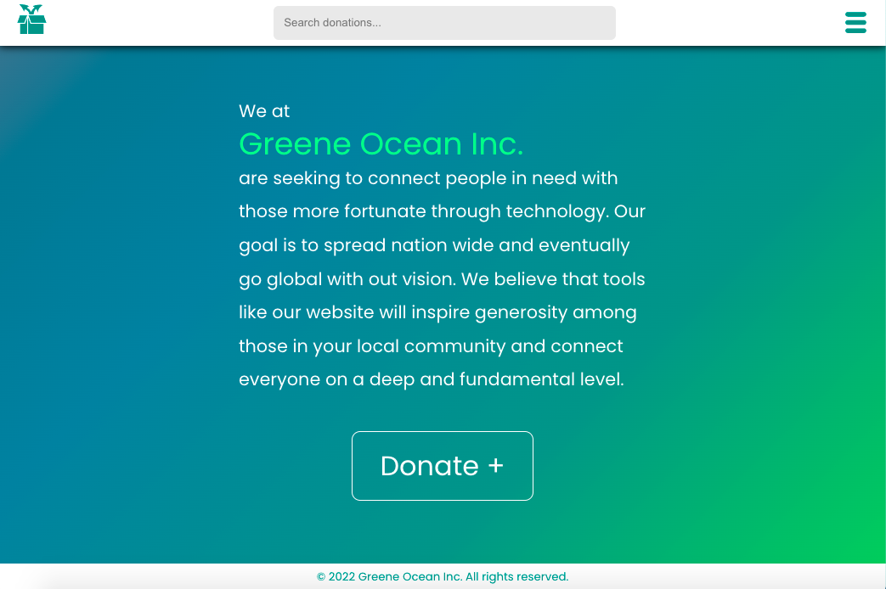
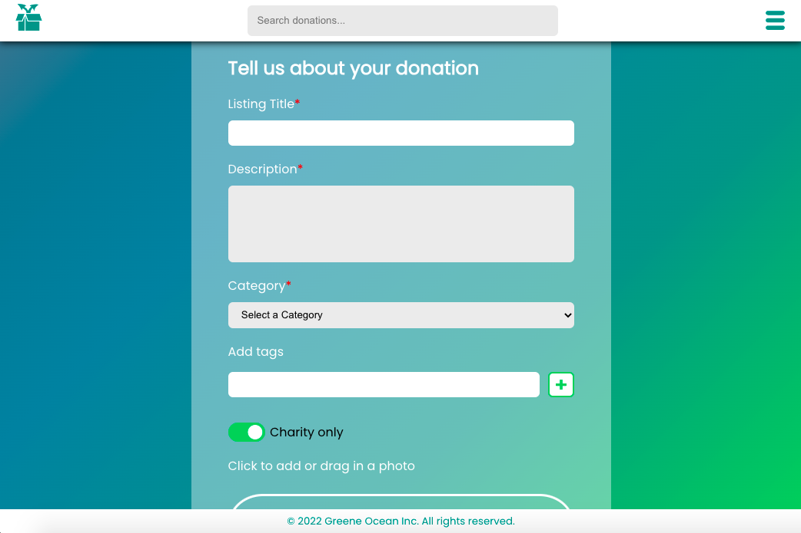

# Project Greene

A donations website where users can create donation listings, browse items up for donation, and connect with other users.
Created by a team of 8 software engineers in roughly 1.5 weeks.

This readme is intended to highlight the contributions of a single developer (@7socks).

## Table of Contents
1. [Description](#description)
2. [Technologies](#technologies)
3. [Screenshots](#screenshots)

## Description
Project Greene was designed based upon an initial concept provided by a client via video meetings. The major features include a search and browse page, donation submission page, a current and past transactions page with support for text and video chat, and distinct user roles for regular users and verified charities.

The donation page allows a user to create and describe a new donation listing, with fields for a title, description, and category, as well as the option to add tags, mark as charity-only, and upload a photo of the donation.

Tags were designed to be used across the application with optional support for click events.

The image upload component was custom built using HTML5 form elements rather than an outside library. It connects with Firebase to store the uploaded image.

## Technologies
This project was built using [React](https://reactjs.org) with React hooks, [Express](https://expressjs.com), [Babel](https://babeljs.io), and [Webpack](https://webpack.js.org). Key libraries include [styled components](https://styled-components.com) and [react icons](https://react-icons.github.io/react-icons). Images uploaded via the donation page are stored using [Firebase](https://firebase.google.com).

## Screenshots
**Home page**

**Donation page**
